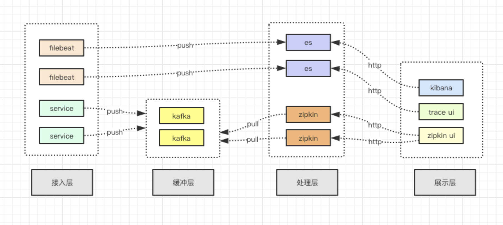

# 项目背景
基于springboot的全链路监控技术，基于zipkin实现。提供了kafka封装，跨线程传递，前端header关联，日志集成等功能

# 使用步骤
## 项目配置
### 1.maven配置
```xml
<dependency>  
    <groupId>com.zzl</groupId>
    <artifactId>zipkin-spring-boot-starter</artifactId>
    <version>1.0-SNAPSHOT</version>
</dependency>
```

### 2.application.yml配置
```yaml
spring:
  #全链路监控配置
  zipkin:
    #开启监控
    enabled: true
    #使用kafka发送数据到zipkin
    sender:
      type: kafka
    kafka:
      bootstrap-servers: xxx
      topic: xxx
  sleuth:
    #采样率
    sampler:
      probability: 1.0
    #监控kafka
    messaging:
      kafka:
        enabled: true 
```
          
## 组件接入
### 1.dubbo

要手动激活filter
```yml
dubbo:
  provider:
    filter: tracing
  consumer:
    filter: tracing
```

### 2.mysql

在jdbc连接url后面，追加参数就行，添加statementInterceptors
```text
jdbc:mysql://xxx?statementInterceptors=brave.mysql.TracingStatementInterceptor
```

### 3.kafka

```text
使用包装了trace功能的生产者来发送消息
private Producer<String, byte[]> producer = new ZipkinKafkaProducer<>(properties, tracing);

消费者消费消息时，对于每个消息的处理，要使用ZipkinKafkaConsumerHelper包装，负责解析trace信息
private ZipkinKafkaConsumerHelper<String, byte[]> zipkinKafkaConsumerHelper = new ZipkinKafkaConsumerHelper<>(tracing);
zipkinKafkaConsumerHelper.traceCallBack(record, () -> processMsg(record));
```

### 4.thread

多线程切换比较麻烦， 要手动传递。包装的原理，就是传递trace信息
```text
包装线程
Runnable traceRunnable = new TraceRunnable(tracing, runnable);
 
包装线程池
TraceableExecutorService traceableExecutorService = new TraceableExecutorService(threadPoolExecutor, tracing);
```
### 5.auto


# 原理剖析


```text
1.zipkin客户端负责trace收集，发送到kafka。zipkin服务端消费kafka数据，存储到elasticsearch
2.zipkin客户端通过mdc将trace信息关联到log4j2，用来日志集成trace信息
3.日志收集方案，filebeat->elasticsearch（使用grok解析日志格式）
```